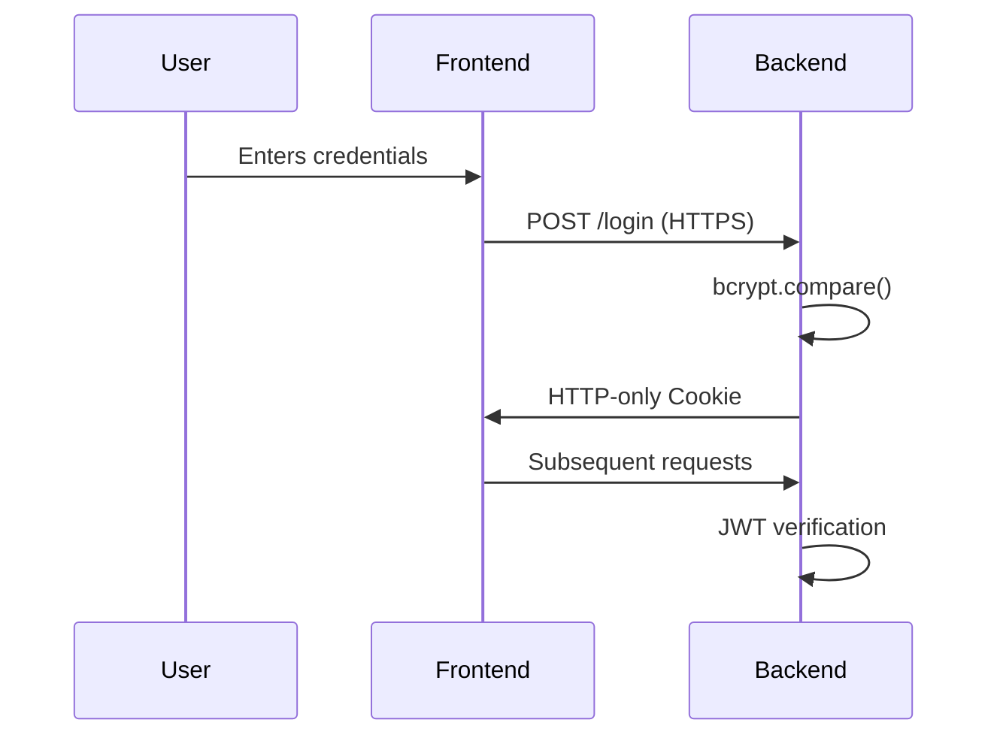

# 🔒 SecureDork - Advanced Query Generator with Security Protections

 
*(Replace with your actual project screenshot)*

## 🌟 Features

| Feature | Description | Security Benefit |
|---------|------------|------------------|
| 🔐 JWT Authentication | Secure token-based auth with HTTP-only cookies | Prevents XSS token theft |
| 🛡️ Input Validation | Multi-layer validation (client + server) | Blocks injection attacks |
| ⏱️ Rate Limiting | 5 attempts/15 minutes on auth endpoints | Prevents brute force |
| 📜 Audit Logging | Tamper-evident logs of all critical actions | Enables accountability |
| 🚦 CORS Whitelisting | Strict origin control for API endpoints | Prevents CSRF attacks |
| 🔄 Secure Sessions | SameSite+Secure cookies with 1hr expiration | Mitigates session hijacking |

## 🚀 Quick Start

### Prerequisites
- Node.js 16+
- npm 8+
- SQLite3

```bash
# Clone repository
git clone https://github.com/yourusername/secure-dork.git
cd secure-dork

# Install dependencies
npm install

# Configure environment
cp .env.example .env
# Edit .env with your settings

# Start development servers
npm run dev
```

## 🏗️ Project Structure

```
secure-dork/
├── backend/               # Node.js server
│   ├── node/
│   │   ├── auth.js        # Authentication middleware
│   │   ├── audit.js       # Logging system
│   │   ├── server.js      # Main application
│   │   └── db.js          # Database configuration
├── frontend/              # React application
│   ├── src/
│   │   ├── api.js         # API service layer
│   │   ├── App.js         # Main application
│   │   └── components/    # UI components
└── docker-compose.yml     # Container orchestration
```

## 🛡️ Security Implementation

### Authentication Flow


### Key Security Code
```javascript
// Secure cookie settings
res.cookie('token', token, {
  httpOnly: true,
  secure: process.env.NODE_ENV === 'production',
  sameSite: 'strict',
  maxAge: 3600000 // 1 hour
});

// Rate limiting middleware
const authLimiter = rateLimit({
  windowMs: 15 * 60 * 1000,
  max: 5,
  message: 'Too many login attempts'
});
```

## 📊 OWASP Top 10 Coverage

| OWASP Risk | Mitigation |
|------------|------------|
| Injection | Parameterized queries + Input validation |
| Broken Auth | JWT + HTTP-only cookies + bcrypt |
| Sensitive Data Exposure | Secure cookie attributes |
| XXE | Disabled XML parsing |
| Broken Access Control | Route protection middleware |
| Security Misconfig | Helmet.js + CORS whitelisting |
| XSS | React DOM escaping + CSP |
| Insecure Deserialization | JSON parsing only |
| Vulnerable Components | npm audit + Dependabot |
| Insufficient Logging | Comprehensive audit trail |

## 🧪 Testing

```bash
# Run security audit
npm audit

# Run ESLint
npm run lint

# Run Jest tests
npm test
```

## 📈 Deployment

[](https://heroku.com/deploy)
[](https://app.netlify.com/start/deploy)

```bash
# Production build
npm run build

# Docker deployment
docker-compose up -d --build
```

## 🤝 Contributing

1. Fork the project
2. Create your feature branch (`git checkout -b feature/AmazingFeature`)
3. Commit your changes (`git commit -m 'Add some amazing feature'`)
4. Push to the branch (`git push origin feature/AmazingFeature`)
5. Open a Pull Request

## 📜 License

Distributed under the MIT License. See `LICENSE` for more information.

## ✉️ Contact

Project Maintainer: [Rana Uzair Ahmad](mailto:dynamo89247@gmail.com)  


---

<div align="center">
  <sub>Built with ❤️ by Dynamo2k1 | Documentation generated by <a href="https://github.com/Dynamo2k1">SecureDork</a></sub>
</div>
